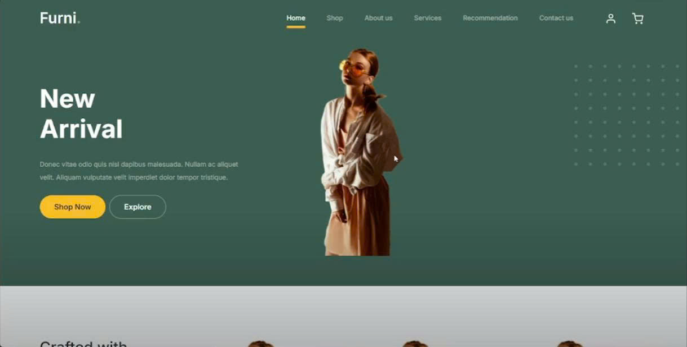
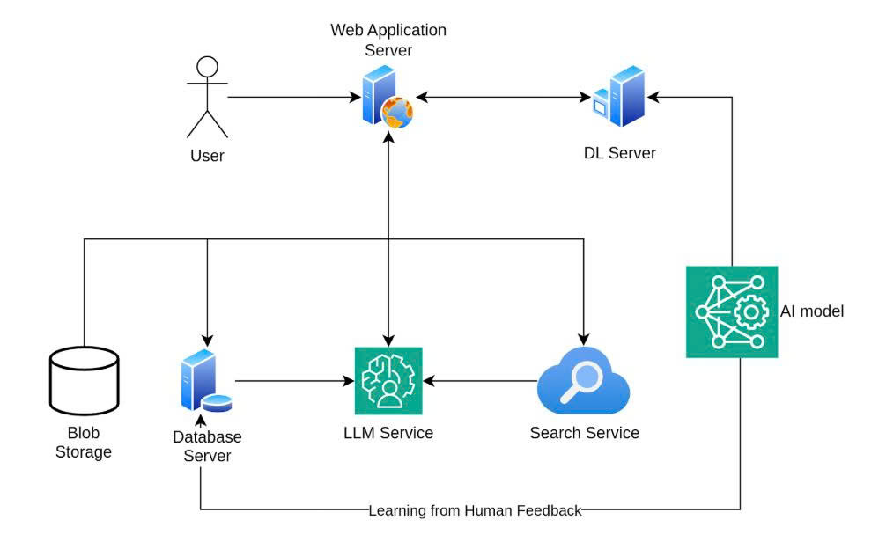
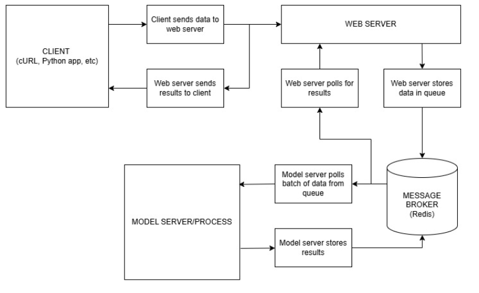
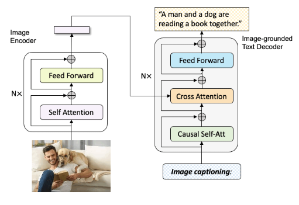
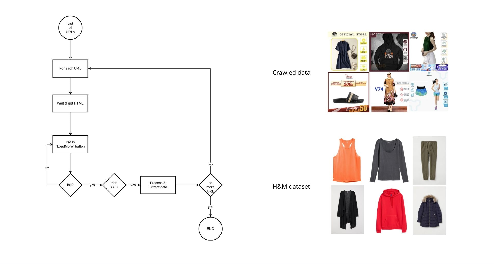
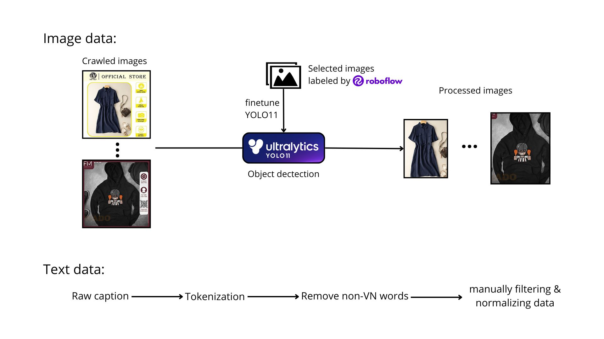
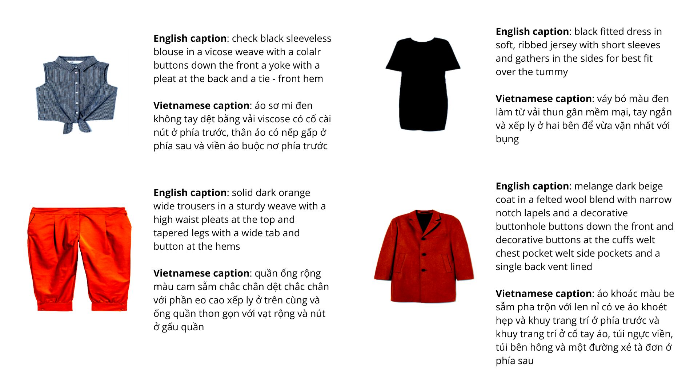

# Fashion-Auto-SEO

<p align="center">
    <a href="https://www.youtube.com/watch?v=e3ZIJRqdkMY" target="_blank">
        
    </a>
</p>
<p align="center">
    <b>Watch the demo video on YouTube</b>
</p>

## 1. Directory structure
```commandline
├── web
│   └── be_and_fe_goes_here
├── crawler
│   └── delete_this.txt
├── modeling
│   ├── data
│   │   ├── preprocessed
│   │   │   └── preprocessed_data_goes_here
│   │   └── raw
│   │       └── raw_data_goes_here
│   ├── logs
│   │   └── log_for_training_testing_etc
│   ├── models
│   │   └── models_goes_here
│   ├── notebooks
│   │   └── notebooks_for_experimental
│   ├── outputs
│   │   └── model_outputs_for_inference
│   └── scripts
│       └── main.py
└── README.md
└── run.sh

```

## 2. Overall pipeline

<p align="center">
    
</p>

<p align="center">
    
</p>


## 3. Model
<p align="center">
    
</p>


- BLIP-base: https://huggingface.co/Salesforce/blip-image-captioning-base
- Paper: https://arxiv.org/abs/2201.12086
- Weights: https://huggingface.co/kzap201/fashion_BLIP

To load model from huggingface, use:
```python
from transformers import BlipForConditionalGeneration

model = BlipForConditionalGeneration.from_pretrained(
    'kzap201/fashion_BLIP',
    revision='<version>'  # Replace <version> with the desired checkpoint version
)
```

Checkpoints:
|  Date       | Version   | BLEU-1 | BLEU-2 | BLEU-3 | BLEU-4 | METEOR | ROUGE-L | CIDEr |
|-------------|-----------|--------|--------|--------|--------|--------|---------|-------|
|  05/04/2025 | v1.0      | 0.506  | 0.407  | 0.337  | 0.287  | 0.284  | 0.494   | 1.755 |
|  06/04/2025 | v2.0      | 0.511  | 0.411  | 0.341  | 0.289  | 0.293  | 0.506   | 1.772 |

To support Vietnamese caption, we're currently using cloud translate service from Google

## 4. Data
Dataset: 
- Crawled from web (over 20k images)
- H&M caption dataset (https://huggingface.co/datasets/tomytjandra/h-and-m-fashion-caption) 

<p align="center">
    
</p>

Data preprocessing:
<p align="center">
    
</p>

## 5. Demo inference results
<p align="center">
    
</p>

